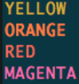

<!--
  Created by: Ethan Baker (contact@ethanbaker.dev)
  
  Adapted from:
    https://github.com/othneildrew/Best-README-Template/
-->

<div id="top"></div>


<!-- PROJECT SHIELDS/BUTTONS -->
<!-- 
  Netlify buttons:
[]()
  Golang specific buttons:
NEED GITHUB WORKFLOW 
-->

[](https://godoc.org/github.com/ethanbaker/colors)
[](https://goreportcard.com/report/github.com/ethanbaker/colors)
[](https://raw.githack.com/wiki/ethanbaker/colors/coverage.html)
[![Contributors][contributors-shield]][contributors-url]
[![Forks][forks-shield]][forks-url]
[![Stargazers][stars-shield]][stars-url]
[![Issues][issues-shield]][issues-url]
[![License][license-shield]][license-url]
[![LinkedIn][linkedin-shield]][linkedin-url]


<!-- PROJECT LOGO -->
<br><br><br>
<div align="center">
  <a href="https://github.com/ethanbaker/colors">
    
  </a>

  <h3 align="center">Colors</h3>

  <p align="center">
    ANSI Terminal Color in Golang, for Golang
  </p>
</div>


<!-- TABLE OF CONTENTS -->
<details>
  <summary>Table of Contents</summary>
  <ol>
    <li>
      <a href="#about-the-project">About</a>
      <ul>
        <li><a href="#built-with">Built With</a></li>
      </ul>
    </li>
    <li>
      <a href="#getting-started">Getting Started</a>
      <ul>
        <li><a href="#prerequisites">Prerequisites</a></li>
        <li><a href="#installation">Installation</a></li>
      </ul>
    </li>
    <li><a href="#usage">Usage</a></li>
    <li><a href="#roadmap">Roadmap</a></li>
    <li><a href="#contributing">Contributing</a></li>
    <li><a href="#license">License</a></li>
    <li><a href="#contact">Contact</a></li>
    <li><a href="#acknowledgments">Acknowledgments</a></li>
  </ol>
</details>


<!-- ABOUT -->
## About

<!--![Project demonstration image][product-screenshot]-->

Colors is an ANSI color library in Golang. Hundreds of ANSI color constants are defined for use in terminal applications in need of color. Different color helper functions exist to help convert color values between one another. 

<p align="right">(<a href="#top">back to top</a>)</p>


### Built With

* [Golang](https://go.dev/)

<p align="right">(<a href="#top">back to top</a>)</p>


<!-- GETTING STARTED -->
## Getting Started

Because colors is a standalone project made completely with Go, it can be used in any repository. Simply make sure the prerequisites are met and then follow the installation steps below.

Colors offers hundreds of colors that can only be viewed if your terminal is [true color compatable](https://unix.stackexchange.com/questions/450365/check-if-terminal-supports-24-bit-true-color). If you terminal is not true color compatable, it may only be able to render xterm or solarized colors, leading to "different" colors of similar shade to look the exact same.

### Prerequisites

* Golang is installed
* Git is installed

### Installation

To include the Colors package in your own Golang application, include the line `import "github.com/ethanbaker/colors"`.

If you want to use css colors, solarized colors, or xterm colors specifically in your project, import that sub-project by including the line `import "github.com/ethanbaker/colors/SUB_PROJECT"`, where `SUB_PROJECT` can be `css`, `sol`, or `xterm`.

To make shell commands from the package, clone the repository and run `go install ./...` in the `cmd/` directory. Command usage can be found for each command and in the [documentation][documentation-url]. 

<p align="right">(<a href="#top">back to top</a>)</p>


<!-- USAGE EXAMPLES -->
## Usage

When using Colors in your own program, you can easily print a wide range of colors by formatting something like this in your code:

```go
fmt.Println(css.Aqua + "This will print the css color aqua!" + css.AnsiReset)

fmt.Println(sol.Y + "This will print the sol color yellow!" + sol.AnsiReset)

fmt.Println(xterm.Maroon + "This will print the xterm color maroon!" + xterm.AnsiReset)
```

_For more examples, please refer to the [documentation][documentation-url]._

<p align="right">(<a href="#top">back to top</a>)</p>


<!-- ROADMAP -->
## Roadmap

- [x] CSS Colors
- [x] Color converting utils
- [ ] Xterm Colors

See the [open issues][issues-url] for a full list of proposed features (and known issues).

<p align="right">(<a href="#top">back to top</a>)</p>


<!-- CONTRIBUTING -->
## Contributing

For issues and suggestions, please include as much useful information as possible.
Review the [documentation][documentation-url] and make sure the issue is actually
present or the suggestion is not included. Please share issues/suggestions on the
[issue tracker][issues-url].

For patches and feature additions, please submit them as [pull requests][pulls-url]. 
Please adhere to the [conventional commits][conventional-commits-url]. standard for
commit messaging. In addition, please try to name your git branch according to your
new patch. [These standards][conventional-branches-url] are a great guide you can follow.

You can follow these steps below to create a pull request:

1. Fork the Project
2. Create your Feature Branch (`git checkout -b branch_name`)
3. Commit your Changes (`git commit -m "commit_message"`)
4. Push to the Branch (`git push origin branch_name`)
5. Open a Pull Request

<p align="right">(<a href="#top">back to top</a>)</p>


<!-- LICENSE -->
## License

This project uses the Apache 2.0 license.

You can find more information in the [LICENSE][license-url] file.

<p align="right">(<a href="#top">back to top</a>)</p>


<!-- CONTACT -->
## Contact

Ethan Baker - contact@ethanbaker.dev - [LinkedIn][linkedin-url]

Project Link: [https://github.com/ethanbaker/colors][project-url]

<p align="right">(<a href="#top">back to top</a>)</p>


## Acknowledgments

* [@rwxrob](https://github.com/rwxrob) for contributing and starting off this project

<p align="right">(<a href="#top">back to top</a>)</p>


<!-- MARKDOWN LINKS & IMAGES -->
<!-- https://www.markdownguide.org/basic-syntax/#reference-style-links -->
[contributors-shield]: https://img.shields.io/github/contributors/ethanbaker/colors.svg
[forks-shield]: https://img.shields.io/github/forks/ethanbaker/colors.svg
[stars-shield]: https://img.shields.io/github/stars/ethanbaker/colors.svg
[issues-shield]: https://img.shields.io/github/issues/ethanbaker/colors.svg
[license-shield]: https://img.shields.io/github/license/ethanbaker/colors.svg
[linkedin-shield]: https://img.shields.io/badge/-LinkedIn-black.svg?logo=linkedin&colorB=555

[contributors-url]: <https://github.com/ethanbaker/colors/graphs/contributors>
[forks-url]: <https://github.com/ethanbaker/colors/network/members>
[stars-url]: <https://github.com/ethanbaker/colors/stargazers>
[issues-url]: <https://github.com/ethanbaker/colors/issues>
[pulls-url]: <https://github.com/ethanbaker/colors/pulls>
[license-url]: <https://github.com/ethanbaker/colors/blob/master/LICENSE>
[linkedin-url]: <https://linkedin.com/in/ethandbaker>
[project-url]: <https://github.com/ethanbaker/colors>

[product-screenshot]: path_to_demo
[documentation-url]: <https://pkg.go.dev/github.com/ethanbaker/colors>

[conventional-commits-url]: <https://www.conventionalcommits.org/en/v1.0.0/#summary>
[conventional-branches-url]: <https://docs.microsoft.com/en-us/azure/devops/repos/git/git-branching-guidance?view=azure-devops>